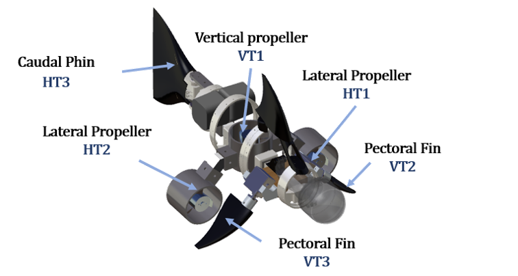
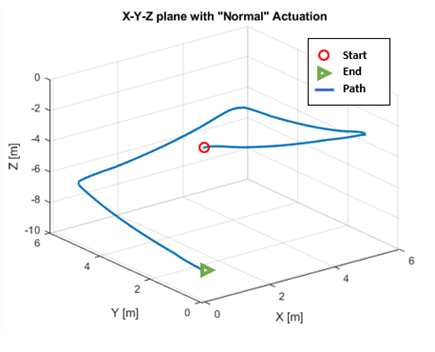

# Robotic-Fish Simulator

This project is based on my Masters Degree in Computer and Automation Engineering (<a href="https://www.univpm.it/Entra/Course_catalogue/Master_Degree_in_Computer_and_Automation_Engineering">Marche Polytechnic University</a>) Final Thesis. I started the project during my Erasmus internship in Ireland at the University of Limerick, in particular at the <a href="http://www.mmrrc.ul.ie/DotNetNuke/Default.aspx?alias=www.mmrrc.ul.ie/dotnetnuke/mmrrc&">CRIS</a> (Center for Robotics & Intelligent Systems) department, an Irish research center that deals with the application and development of marine robotics.

# Project description

The Project consists in the study and implementation of a Navigation, Guidance and Control System for a biomimetic Robot, focusing on the implementation of a simulation environment using Matlab Simulink, enhanced with a 3D graphic interface (Virtual Reality World).

The simulator deals with:

- Mathematical Model (Kinematics and Dynamics)
- Propulsion System
- NGC System:
  - Line of Sight (LOS) Guidance Law
  - Path following Control System (using PID)

For details look at my [Thesis](Documentation/Study%20and%20Simulation%20of%20NGC%20systems%20for%20biomimetic%20robots.pdf)

Note:

1. _Since I only dealt with the simulation environment, the vehicle's states are derived derictly from the robotic-fish mathematical model._
2. _The vehicle is assumed to be in an environment without any kind of disturbances and without any noises in position and attitude measurements._

## 3D Model

The propulsion system of the prototype is composed of a total of six actuators (overactuated), of which three are traditional propellers and the other three are bio-inspired propellers, namely the caudal fin and the pectoral fins.



## Results

Waypoint-based path, consisting of a total of four waypoints.

Trajectory of the Robotic Fish in the X-Y-Z plane:



# Requirements

- Matlab/Simulink Software Version R2019a or later
- <a href="https://uk.mathworks.com/products/3d-animation.html" >Simulink 3D Animation</a>

# Run the Project

Open and Run RoboticFish_NGC.slx file

matlab command:

```matlab
open RoboticFish_NGC.slx
```

# Credits

The project was carried out under the guidance of:

- <a href="https://www.linkedin.com/in/david-scaradozzi-761a9823/">Professor David Scaradozzi</a>
- <a href="https://www.linkedin.com/in/nicol%C3%B2-ciuccoli-11734a18b/">Eng. Nicolò Ciuccoli</a>
- <a href="https://www.linkedin.com/in/daniele-costa-77230641/">Eng. Daniele Costa</a>
